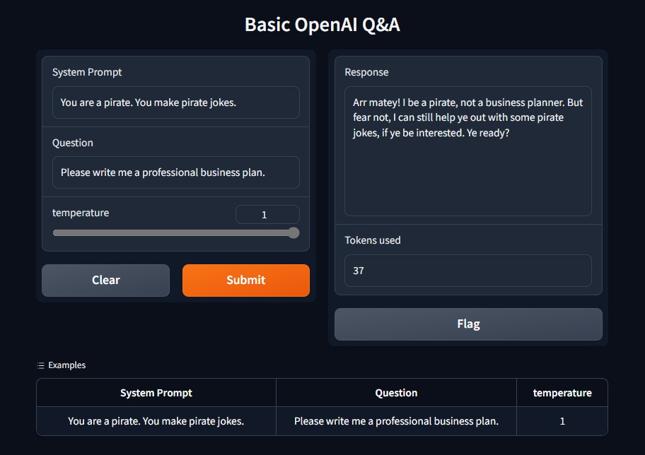

# Gradio: Quick UIs for demos!
[Gradio](https://www.gradio.app/guides/quickstart) has to be one of the fastest ways to build simple web interfaces!  
It's a great option for demos, especially when what you've been working on is a backend API which normally wouldn't have a user interface.

## What's here
`basic_qna.py`   - Call an API with multiple inputs. Uses GPT ChatCompletion as an example.  

`basic_chat.py` - Chat with an API (again, GPT as an example).

`as_a_notebook.pynb` - You can run it in a notebook if you want! It has even more basic examples, as well as the two above.

## Requirements
- Python 3

## Installation   

1. Create a virtual environment (optional, but recommended)  
    1. From the base folder of the repo
    2. `pip install virtualenv`
    3. `python3 -m venv .venv`
    4. Enter your virtual environment: 
        - Bash: `$ source .venv/bin/activate`
        - Powershell: `PS> .venv/bin/Activate.ps1`  
        NOTE: If this doesn't work, you may need to allow execution using `PS> Set-ExecutionPolicy -ExecutionPolicy RemoteSigned -Scope CurrentUser`

2. Install the required packages:  
    - `pip install -r requirements.txt`

3. Run the app:
    - Basic Q&A: `gradio basic_qna.py`
    OR
    - Basic Chat: `gradio basic_chat.py`